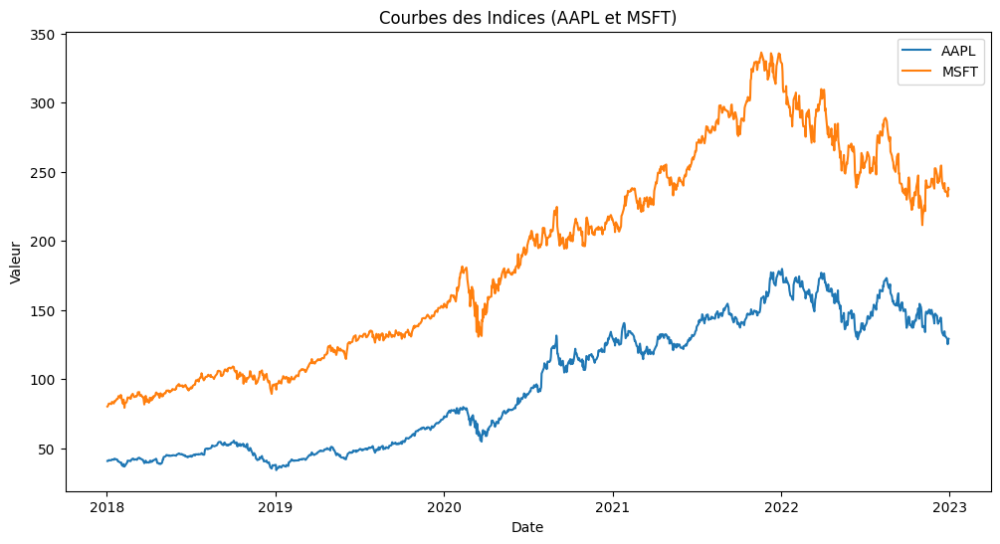
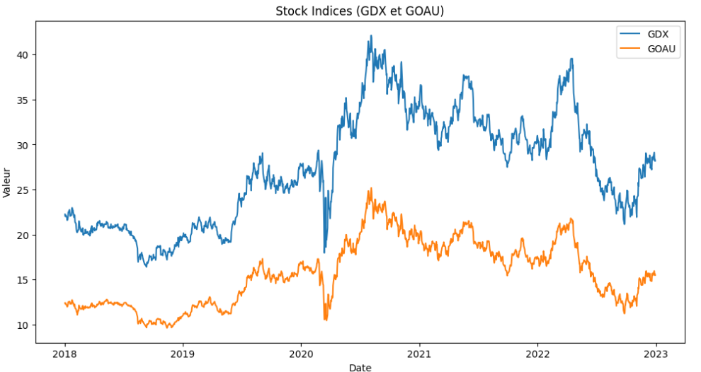

# Cointegration Analysis in Financial Time Series

In financial markets, it's common to observe relationships between time series data that may appear correlated in the short term but lack a meaningful long-term connection. These apparent correlations, known as spurious correlations, can lead to misleading conclusions and ineffective trading strategies. To distinguish between spurious correlations and genuine long-term relationships, we employ the concept of cointegration and the Engle-Granger two-step method.

Cointegration allows us to identify pairs of non-stationary time series that exhibit a stable long-term relationship, even though they may individually drift apart in the short run. The Engle-Granger method provides a framework for testing cointegration, involving regression and residual analysis.

## Introduction

In financial markets, it is common to observe correlations between time series data that may appear significant in the short term but lack meaningful long-term connections. These apparent correlations, known as spurious correlations, can mislead analysts and traders into forming ineffective strategies. Spurious relationships arise when two or more non-stationary time series seem correlated purely by chance, often due to common trends or cycles rather than a true underlying relationship. Recognizing and distinguishing these spurious correlations is crucial for accurate financial analysis.

Figure1: indices of Apple Inc and Microsoft Corp from 2018 to 2023.

Figure2: indices of VanEck Gold Miners ETF and US Global GO GOLD and Precious Metal Miners ETF from 2018 to 2023.

Both of them appear to be correlated, but are they really?

## Cointegration

Cointegration is a statistical property of time series variables that allows us to identify pairs (or groups) of non-stationary series that move together over the long term. Even if the individual time series exhibit random walks or trends, a cointegrated relationship implies that they maintain a stable equilibrium relationship over time. This concept is essential for financial applications, as it suggests that despite short-term fluctuations, certain asset prices have a predictable long-term relationship, which can be exploited in trading strategies.

## Engle-Granger Two-Step Method

The Engle-Granger two-step method is a widely used approach for testing cointegration between two non-stationary time series. 

1. **Step 1**: A linear regression is performed on the two time series to estimate their relationship. The residuals from this regression capture the deviation from the estimated equilibrium relationship.

2. **Step 2**: The residuals are then tested for stationarity using tests such as the Augmented Dickey-Fuller (ADF) test. If the residuals are found to be stationary, it suggests that the original series are cointegrated, indicating a long-term relationship between them.

This method provides a robust framework for identifying meaningful relationships in financial data, thereby allowing for more informed decision-making in trading strategies.

## Project Overview

This project investigates the concept of cointegration in financial time series data, focusing on identifying stable long-term relationships between pairs of stocks. The analysis utilizes historical price data sourced from Yahoo Finance through the `yfinance` library, allowing for a comprehensive examination of stock behavior over time.

### Data Collection
Historical stock price data is obtained using the `yfinance` library, which allows for easy access to a wide range of financial data directly from Yahoo Finance.

### Methodology
- **Engle-Granger Two-Step Method**: The project implements the Engle-Granger two-step method for testing cointegration using `statsmodels` library for statistical modeling and conducting regression analysis and hypothesis tests we also used `matplotlib` For visualizing data and results.

## Dependencies

You can find the complete list of dependencies in the `requirements.txt` file.

## References
- FSB Miami University. (n.d.). Lectures from Miami University. Retrieved from https://fsb.miamioh.edu/lij14/
- Tyler Vigen. (n.d.). Spurious correlations: A website for funny spurious correlation examples. Retrieved from https://tylervigen.com/spurious-correlations
- Engle, R. F., & Granger, C. W. J. (1987). Co-Integration and Error Correction: Representation, Estimation, and Testing. Econometrica, 55(2), 251–276. https://doi.org/10.2307/1913236

## Contact

For questions, feedback, or collaborations, please contact [BOULAICH Mohamed](mailto:boulaich.mohamed970@gmail.com).
